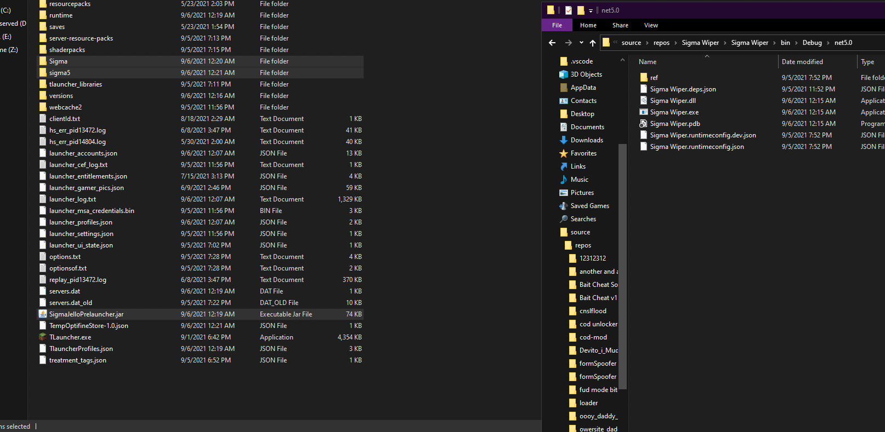

# Sigma Wiper
Wipe Sigma Out!

## Description
#### This tool is used to remove all files associated with Sigma Client! Sigma is a very famous Minecraft Hacked Client, which contains a Monero(xmr) miner! So unlike other clients / hacked clients, this one is malicious and drops a malicious file on your pc for malicious purposes!

## T.O.S

###### This repository/project is under MIT licence! Use it in terms of it!

### Preview:

## How2Contribute
###### You can make my spaghetti code a bit more not spaghetti!
###### You can Star my repository!
###### Share the repository because noone should get their PC's used for someones illegal profit. (Shame on you Omikrons)

## Credits:
###### XatzClient - Sigma Deleter ( https://github.com/XatzClient/Sigma-Deleter/ )
###### This repository gave me idea to do the same in c#, i support them and i am very happy that repositories on github like that one exist, upvotes for XatzClient team!
###### 
###### Marex / Reflect for pointing out & reaching me about the whole case with Sigma!

## Disclaimer:
#### Owersite(creator) is not is not resposible for whatever you do with this, it is made for educational purposes only!
